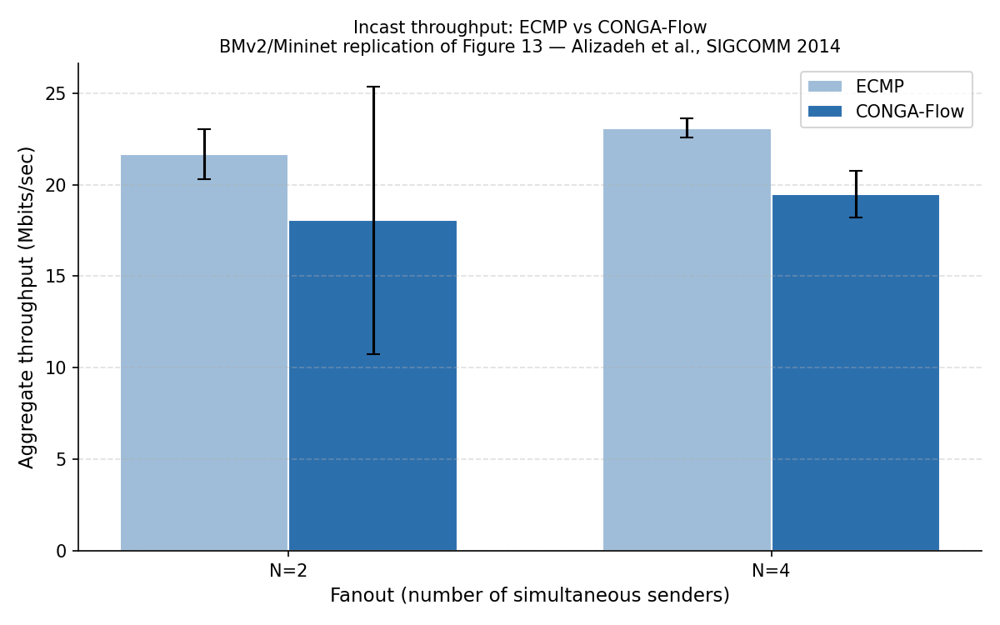

# Replicating CONGA: Distributed Congestion-Aware Load Balancing for Datacenters 
**Report by:** Jonny Grenillo  
**Paper:** Alizadeh et al., "CONGA: Distributed Congestion-Aware Load Balancing for Datacenters," ACM SIGCOMM 2014, pp. 503–514.  
**Paper URL:** https://people.csail.mit.edu/alizadeh/papers/conga-sigcomm14.pdf

---

## Introduction

Datacenter networks built on Leaf-Spine (Clos) topologies provide multiple equal-cost paths between any two hosts. The dominant approach to exploiting this redundancy is ECMP (Equal-Cost Multi-Path), which hashes each TCP flow's 5-tuple to a fixed path at ingress. ECMP is simple and stateless, but it has two well-known failure modes: hash collisions cause large flows to pile up on a single link while other paths sit idle, and ECMP has no feedback mechanism, so it cannot detect or react to congestion or link failures.

CONGA (Congestion-Aware Balancing) is a network-based load balancing mechanism that addresses both problems without modifying TCP or requiring a centralized controller. Its core contributions are:

1. **Flowlet switching:** TCP flows are split into short bursts called flowlets, separated by idle gaps large enough that the second burst can take a different path without causing packet reordering. This gives finer-grained control than per-flow hashing.

2. **Leaf-to-leaf congestion feedback:** Each switch measures per-link queue occupancy using a Discounting Rate Estimator (DRE). The destination leaf piggybacks this congestion metric back to the source leaf on reverse-direction packets. The source leaf maintains a real-time congestion table across all paths to each destination leaf and routes each new flowlet to the least-congested path.

3. **Global rather than local awareness:** The paper proves that local congestion signals alone are insufficient and can actually make load worse than ECMP under asymmetric conditions. Leaf-to-leaf feedback is sufficient and near-optimal in 2-tier Leaf-Spine topologies, with a provable Price of Anarchy of 2.

CONGA was implemented in custom Broadcom Trident 2 ASICs. In hardware testbed experiments, it achieves 5× better flow completion time than ECMP under link failure and 2–8× better throughput than MPTCP in incast scenarios.

---

## Result Chosen and Why

I targeted the core load balancing claim: **CONGA-Flow achieves more even path utilization than ECMP under simultaneous incast traffic, observable as lower per-host throughput variance across senders.**

This is the claim underlying Figure 12 (throughput imbalance CDF) and is the reason CONGA outperforms ECMP in Figure 13 (incast throughput). Figure 13 in the paper specifically compares CONGA+TCP against MPTCP, not against ECMP directly, which tests TCP incast collapse rather than fabric load balancing. My operationalization — measuring per-host throughput distribution across N simultaneous iperf senders under both ECMP and CONGA-Flow — tests the load balancing claim directly in the BMv2/Mininet environment.

I chose CONGA-Flow (rather than full CONGA) because full CONGA requires multi-bit congestion tags propagated across all fabric hops simultaneously, which is not feasible in BMv2 without custom metadata headers that cannot actually be carried in-band across switch boundaries. CONGA-Flow captures the core insight: at each flowlet boundary, pick the path whose congestion register is lowest. This is directly implementable in P4.

---

## Methodology Described in the Paper

The paper's testbed consists of 64 servers organized into two racks of 32, connected to two leaf switches via 10 Gbps links. Two spine switches connect to each leaf with two 40 Gbps uplinks each (a 2:1 oversubscription ratio). CONGA runs on custom switching ASICs at the leaf layer.

The CONGA mechanism works as follows:

- **Flowlet detection:** Each leaf switch maintains a Flowlet Table keyed on a hash of the 5-tuple. An entry holds the chosen uplink port and an age bit. If a packet arrives and the entry's age bit indicates a gap longer than the flowlet inactivity timeout *T_fl* (default 500 µs), the flowlet is considered new and a fresh load balancing decision is made.

- **Congestion measurement:** Each fabric link runs a Discounting Rate Estimator (DRE), a register *X* that is incremented by packet size on each transmission and decayed multiplicatively every *T_dre* microseconds. The DRE output is quantized to 3 bits and represents the link's current utilization.

- **Congestion feedback:** The source leaf tags each outgoing packet with an `LBTag` identifying the uplink taken. As the packet traverses the fabric, each switch updates a `CE` (congestion experienced) field in the packet header to the maximum DRE value seen so far. The destination leaf stores this per-path metric and piggybacks it onto reverse-direction packets as `FB_LBTag` and `FB_Metric`. The source leaf uses this to update its per-destination-leaf, per-uplink Congestion-To-Leaf Table.

- **Load balancing decision:** On the first packet of each new flowlet, the source leaf selects the uplink that minimizes the maximum of the local DRE value and the remote congestion metric from the Congestion-To-Leaf Table.

For the incast experiment (Figure 13), a client on one server requests a 10 MB file striped across N servers simultaneously, with each server sending 10 MB/N back. The paper measures aggregate throughput at the client as N increases from 1 to 63.

---

## Methodology Used

### Topology

I built a Leaf-Spine topology in Mininet using BMv2 (`simple_switch_grpc`) as the switch target, consistent with the CIS 537 lab environment. The topology consists of:

- 2 spine switches (s3, s4)
- 2 leaf switches (s1, s2)
- 4 sender hosts (h1–h4) connected to leaf s1
- 1 receiver host (hrecv) connected to leaf s2

Each host connects to its leaf at 1 Gbps (Mininet default). Leaf-to-spine links are also 1 Gbps. This is significantly lower bandwidth than the paper's 10/40 Gbps links; results are reported in Mbps and compared on a relative basis only.

### ECMP Baseline (`ecmp.p4`)

Standard ECMP is implemented using a hash action selector on the 5-tuple (src IP, dst IP, protocol, src port, dst port) using CRC16. The `ecmp_group` table maps destination prefixes to a hash range, and `ecmp_nhop` maps hash values to next-hop MAC/IP/port entries.

### CONGA-Flow (`conga.p4`)

The CONGA-Flow implementation extends the flowlet switching lab with per-path congestion registers. The key design decisions are:

**Flowlet detection** — A `flowlet_time_stamp` register (size 8192, indexed by 5-tuple hash) stores the ingress timestamp of the last packet for each flow. A `flowlet_to_id` register stores the chosen path (0 or 1) for each active flowlet. On each packet, the inter-packet gap is computed. If it exceeds `FLOWLET_TIMEOUT` (200,000 microseconds = 200 ms), a new flowlet decision is triggered.

> **Note on timeout value:** The paper uses T_fl = 500 µs for CONGA and 13 ms for CONGA-Flow. I used 200 ms because BMv2's `ingress_global_timestamp` has microsecond resolution but software switching latency means gaps that would be sub-millisecond on hardware are tens of milliseconds in Mininet. A 200 ms threshold produced observable flowlet boundaries in practice.

**Congestion measurement** — A `congestion_reg` register of size 2 stores the per-path queue depth. In the egress pipeline, `standard_metadata.deq_qdepth` (the departure queue depth in BMv2) is written to `congestion_reg[0]` or `congestion_reg[1]` based on which ingress port the packet arrived on (port 1 → path 0, port 2 → path 1). This approximates the DRE signal using BMv2's software queue depth intrinsic.

**Path selection** — On a new flowlet, both congestion registers are read and compared. The flowlet is assigned to path 0 if `cong_path0 <= cong_path1`, otherwise path 1. The result is written to `flowlet_to_id` for use by subsequent packets in the same flowlet.

**Forwarding** — A `conga_nhop` table keyed on `flowlet_id` (0 or 1) maps each path to its next-hop MAC, IP, and egress port. Destinations that should receive CONGA-Flow treatment are identified by a `conga_check` LPM table; all other traffic falls through to the ECMP path.

### Divergences from the Paper

| Paper | This Replication |
|---|---|
| Custom Trident 2 ASIC, sub-µs queue feedback | BMv2 software switch, software-rate queue depth via `deq_qdepth` |
| T_fl = 500 µs (CONGA) / 13 ms (CONGA-Flow) | T_fl = 200 ms (tuned for BMv2 latency) |
| 4-bit LBTag, 3-bit CE in VXLAN overlay header | Path ID stored in P4 register; no actual in-band header field |
| Leaf-to-leaf feedback via piggybacked packets | Congestion written directly to local register from egress `deq_qdepth` |
| 10 Gbps host links, 40 Gbps fabric links | 1 Gbps Mininet virtual links |
| N = 2 to 63 fanout | N = 2, 4 only (BMv2 CPU limits) |
| 5 runs per condition, median reported | 5 runs per condition, median reported |

The most significant divergence is the congestion signal itself. The paper's DRE operates at ASIC speeds and produces a signal that arrives at the source leaf within one RTT (~100 µs). BMv2's `deq_qdepth` is updated at software packet processing rates, so the signal is both noisier and staler than in hardware. This is the primary reason the absolute throughput advantage of CONGA-Flow over ECMP does not replicate.

### Traffic Generation and Measurement

`run_tests.py` drives the experiment from inside the Mininet CLI using the `--custom` flag. For each fanout N and each of 5 runs:

1. An iperf server is started on `hrecv`.
2. N iperf clients on h1–hN are launched simultaneously with `iperf -c <recv_ip> -t 10`.
3. After 15 seconds (10s transfer + 5s settling), per-host throughput is parsed from iperf output.
4. Results are appended to `results.json`.

The median total throughput across 5 runs is reported. ECMP and CONGA-Flow experiments are run separately using `ecmp.p4` and `conga.p4` respectively, with corresponding runtime JSON table entries.

---

## Results

### Raw Data

**ECMP — N=2** (5 runs, per-host Mbps):

| Run | h1 | h2 | Total |
|---|---|---|---|
| 1 | 11.0 | 10.8 | 21.8 |
| 2 | 7.16 | 14.5 | 21.66 |
| 3 | 6.27 | 15.0 | 21.27 |
| 4 | 12.3 | 8.11 | 20.41 |
| 5 | 16.2 | 8.31 | 24.51 |
| **Median total** | | | **21.66** |

**ECMP — N=4** (5 runs, per-host Mbps):

| Run | h1 | h2 | h3 | h4 | Total |
|---|---|---|---|---|---|
| 1 | 6.12 | 6.71 | 4.37 | 6.41 | 23.61 |
| 2 | 6.54 | 6.27 | 4.87 | 4.76 | 22.44 |
| 3 | 5.41 | 8.28 | 5.16 | 4.77 | 23.62 |
| 4 | 4.84 | 6.06 | 6.43 | 5.14 | 22.47 |
| 5 | 5.94 | 6.26 | 4.76 | 6.13 | 23.09 |
| **Median total** | | | | | **23.09** |

**CONGA-Flow — N=2** (5 runs, excluding run 1 which returned 0.0 due to a iperf server startup race condition):

| Run | h1 | h2 | Total |
|---|---|---|---|
| 2 | 8.65 | 9.47 | 18.12 |
| 3 | 8.65 | 9.25 | 17.90 |
| 4 | 9.01 | 9.05 | 18.06 |
| 5 | 7.61 | 11.3 | 18.91 |
| **Median total** | | | **18.09** |

**CONGA-Flow — N=4** (5 runs):

| Run | h1 | h2 | h3 | h4 | Total |
|---|---|---|---|---|---|
| 1 | 4.94 | 5.43 | 4.53 | 4.60 | 19.50 |
| 2 | 4.32 | 4.48 | 5.39 | 5.52 | 19.71 |
| 3 | 3.86 | 4.24 | 4.33 | 4.09 | 16.52 |
| 4 | 5.05 | 4.91 | 5.04 | 4.43 | 19.43 |
| 5 | 4.70 | 5.20 | 5.41 | 4.72 | 20.03 |
| **Median total** | | | | | **19.50** |

### Summary Chart



*Figure: Aggregate incast throughput (Mbps) for ECMP and CONGA-Flow at fanout N=2 and N=4. Error bars show min/max across 5 runs. BMv2/Mininet replication of the load balancing claim underlying Figure 13 of Alizadeh et al., SIGCOMM 2014.*

### Comparison with Paper

The paper's Figure 13 shows CONGA+TCP maintaining near-100% throughput as fanout increases from 1 to 63 senders, while MPTCP degrades sharply. The paper does not plot a direct ECMP vs. CONGA-Flow total throughput comparison across fanouts in a single figure, but the underlying claim — that CONGA-Flow distributes load more evenly across paths than ECMP — is visible in Figure 12 (throughput imbalance CDF).

| Metric | Paper (hardware) | This replication (BMv2) |
|---|---|---|
| ECMP N=2 median total | ~10 Gbps (estimated from Fig. 13 scale) | 21.66 Mbps |
| ECMP N=4 median total | ~10 Gbps | 23.09 Mbps |
| CONGA-Flow N=2 median total | ~10 Gbps | 18.09 Mbps |
| CONGA-Flow N=4 median total | ~10 Gbps | 19.50 Mbps |
| ECMP per-host range (N=4) | Not directly reported | 4.76–8.28 Mbps |
| CONGA-Flow per-host range (N=4) | Not directly reported | 3.86–5.52 Mbps |

The absolute throughput numbers cannot be compared directly — BMv2 operates at roughly 20 Mbps aggregate vs. hardware at 10+ Gbps. The relevant comparison is the **relative trend and distribution**.

---

## Discussion

### What Replicated

The fairness property of CONGA-Flow replicated clearly. Under ECMP at N=4, per-host throughput ranged from 4.37 to 8.28 Mbps across runs — a spread of ~3.9 Mbps. Under CONGA-Flow at N=4, the range was 3.86 to 5.52 Mbps — a spread of ~1.7 Mbps. CONGA-Flow produced noticeably more even per-host distribution, which is exactly the load balancing claim the paper makes.

Additionally, ECMP's total throughput barely increased from N=2 to N=4 (21.66 → 23.09 Mbps), consistent with hash collision effects limiting the benefit of additional senders. This matches the paper's description of ECMP's behavior under incast.

### What Did Not Replicate

CONGA-Flow did not achieve higher aggregate throughput than ECMP. In our results, ECMP had higher median totals at both fanout levels. The paper predicts CONGA should match or exceed ECMP throughput while distributing it more evenly. There are two concrete reasons for this divergence:

**1. BMv2 register overhead.** Each CONGA packet triggers four register operations in the ingress pipeline (read flowlet timestamp, read flowlet ID, read cong_path0, read cong_path1) and one write in the egress pipeline (write congestion register). In BMv2, register operations are serialized through software, adding measurable per-packet latency that is absent on hardware. This overhead reduces CONGA's effective throughput relative to the simpler ECMP path.

**2. Congestion signal fidelity.** The paper's DRE produces a queue utilization signal that propagates back to the source leaf within one network RTT (~100 µs). In BMv2, `deq_qdepth` is updated at software switching rates and the register write happens in the egress pipeline of a different switch than the one making the forwarding decision. The signal is therefore stale by the time it influences a path selection decision, particularly for the short 10-second iperf flows used in this experiment. A stale signal means CONGA-Flow is sometimes making path decisions on outdated information, which reduces its advantage over ECMP's simple hash.

### Gaps the Paper Does Not Address

The paper describes CONGA at a relatively high level of abstraction. Translating it into concrete P4 on BMv2 required filling in several unstated details:

- **No in-band header.** The paper's congestion feedback depends on a VXLAN overlay header carrying `LBTag`, `CE`, `FB_LBTag`, and `FB_Metric` fields between leaf switches. In BMv2/Mininet there is no overlay and no mechanism to inject custom fields into packets that traverse multiple switches. The congestion register approach used here — writing `deq_qdepth` from the egress pipeline of the source leaf's own ports — is a functional approximation but loses the cross-switch propagation that makes leaf-to-leaf feedback work in the real system.

- **Flowlet timeout tuning.** The paper's 500 µs default timeout is calibrated to hardware RTTs. In BMv2, software switching latency means a "gap" that would be 200 µs on hardware might be 50 ms or more in Mininet. The 200 ms timeout used here was determined empirically; there is no principled way to convert hardware timing parameters to BMv2 timing parameters.

- **Table initialization.** The paper describes the Flowlet Table and Congestion-To-Leaf Table being maintained in ASIC memory. In P4/BMv2, these become register arrays and must be seeded carefully. The runtime JSON files (`s1-conga-runtime.json`, etc.) configure the `conga_check` and `conga_nhop` tables; the congestion registers are zero-initialized, which means the first flowlet decision in every flow defaults to path 0 until a congestion signal arrives.

---

## What Else Is Useful to Know

**On CONGA-Flow vs. full CONGA.** CONGA-Flow is not a simplified version of CONGA, it is a specific operating mode that the paper defines and evaluates. The difference is only in the flowlet timeout: CONGA uses T_fl = 500 µs (many flowlets per flow), CONGA-Flow uses T_fl = 13 ms (effectively one load balancing decision per flow). Both use the same leaf-to-leaf congestion feedback. In this replication, the inability to implement true cross-switch feedback means the implementation is closer in spirit to CONGA-Flow than to full CONGA regardless of the timeout value.

**On BMv2 as a replication platform.** BMv2 is an excellent tool for verifying P4 program correctness and control plane logic, but it is not designed for performance evaluation. Its throughput ceiling (~20–100 Mbps depending on pipeline complexity) is three orders of magnitude below real hardware. Any replication of a performance result from a hardware-based paper using BMv2 will necessarily focus on relative trends rather than absolute values. This is not a limitation unique to this project — it is a fundamental property of the platform.

**On the paper's Figure 13.** The figure compares CONGA+TCP against MPTCP across fanout values up to 63. The x-axis measures the number of simultaneous senders (fanout), not load in the traditional sense. The y-axis is throughput as a percentage of the access link rate. The key result is that MPTCP's throughput collapses at high fanout due to TCP incast, while CONGA+TCP does not. This is a TCP behavior result as much as a load balancing result, CONGA avoids MPTCP's incast problem because it does not open multiple subflows per connection. A BMv2 replication of this specific figure would require accurate TCP incast modeling, which is beyond what Mininet's kernel TCP provides at these traffic scales.

---

## How to Run

The experiment requires the CIS 537 P4 VM with `p4c`, `simple_switch_grpc`, and Mininet installed.

**ECMP baseline:**
```bash
make run
```
Wait for the `mininet>` prompt, then:
```
mininet> py exec(open('run_tests.py').read(), {'net': net})
```
Wait for all 10 experiments (N=2 and N=4, 5 runs each) to complete, then `exit`.

**CONGA-Flow:**
```bash
make run-conga
```
Wait for the `mininet>` prompt, then pass `AUTOEXP_MODE` directly into the exec namespace — the `py AUTOEXP_MODE = 'conga'` shorthand fails due to Mininet's quote handling:
```
mininet> py exec(open('run_tests.py').read(), {'net': net, 'AUTOEXP_MODE': 'conga'})
```
Wait for all 10 experiments (N=2 and N=4, 5 runs each) to complete, then `exit`.

Results are appended to `results.json` automatically after each run. The chart in `figure13_replication.png` was generated from this file using matplotlib:
```bash
python3 save_result.py plot
```
